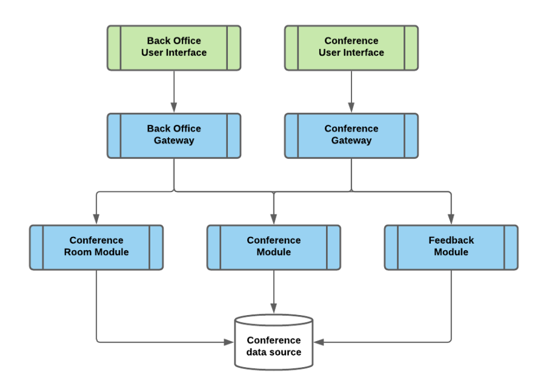

# Conference Platform

The platform allows to create rooms, register or cancel conferences and participants, and leave feedback about conferences.

---

## Table of Contents

1. [Getting Started](#getting-started)
   1. [Prerequisites & Stack](#prerequisites--stack)
2. [Running the Platform](#running-the-platform)
   1. [Build & Run Scripts](#build--run-scripts)
3. [Architecture Overview](#architecture-overview)
   1. [Design](#platform-design)
   2. [Database](#database)
   3. [Database credentials](#database-credentials)
   4. [Core Services to Schemas Mapping](#core-services-to-schemas-mapping)
   5. [Gateway](#gateways)
   6. [](#core-service-to Schema Mapping)
4. [Services & Navigation](#services--navigation)
   1. [Admin UI](#admin-ui)
   2. [Participant UI](#participant-ui)

5. [Code Structure](#code-structure)


---

## Getting Started

### Prerequisites & Stack

- **Java 21**
- **Gradle Wrapper 8.14.2** (supports Java 21)
- **Spring Boot 3.5.3** & **Spring Data JPA**
- **PostgreSQL 17.5**
- **Liquibase 4.31.1**
- **Spring MVC** & **Spring Cloud Gateway WebFlux**
- **Docker 28.1.1** & **Docker Compose v2.35.1-desktop.1**
- **Thymeleaf Template Engine**

---

## Running the Platform

### Build & Run Scripts

| Script                         | Description                                                                                                                     |
|--------------------------------|---------------------------------------------------------------------------------------------------------------------------------|
| `./run_conference_platform.sh` | This is the main script which will clea, build, create images and run all services at once. It consists from another 3 actions. |
| `./clean_build_all.sh`         | Clean and Build all 7 sub-projects.                                                                                             |
| `./build_images.sh`            | Creates Docker images from the built JAR files of each service.                                                                 |
| `./docker-copmpose.yml`        | Configuration to orchestrate run of Docker Containers for Conference Platform.                                           |

**Run main script:**

```bash
./run_conference_platform.sh
```
## Architecture Overview

### Design

For the demo I used third approach of the architecture design:



This approach is best suited to the separation of concerns.

### Database

Each microservice has its own schema. For the purposes of this demo, we run a single database container but partition it into three isolated schemas - `c_control`, `c_room`, and `c_feedback` - to simulate separate databases.

The SQL script that creates the schemas, roles, and credentials is here:  
[db-init/init_db_container.sql](db-init/init_db_container.sql)

Superuser has access to all three schemas.

### Database credentials
| user type/schema | username                    | password        |
|------------------|-----------------------------|-----------------|
| superuser        | conference_platform_db_user | changeme        |
| c_room           | c_room_user                 | c_room_user     |
| c_control        | c_control_user              | c_control_user  |
| c_feedback       | c_feedback_user             | c_feedback_user |

### Core Services to Schemas Mapping

- **Conference Room Module** (`c_room`)
- **Conference Control Module** (`c_control`)
- **Conference Feedback Module** (`c_feedback`)

### Gateways

Both gateway modules are built with Spring Cloud WebFlux Gateway and configured declaratively:

- **Back Office Gateway (internal)**: `back-office-gateway`
- **Conference Gateway (external)**: `conference-gateway`

### User Interfaces

The UI services use Spring MVC with the Thymeleaf template engine for a lightweight, server-rendered interface.

- **Back Office User Interface (internal)**: `back-office-ui`
- **Conference User Interface (external)**: `external-ui`
